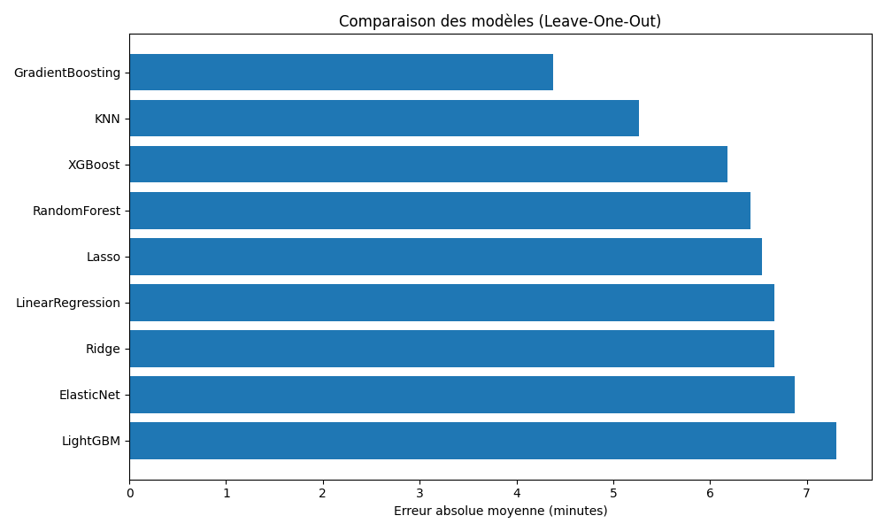
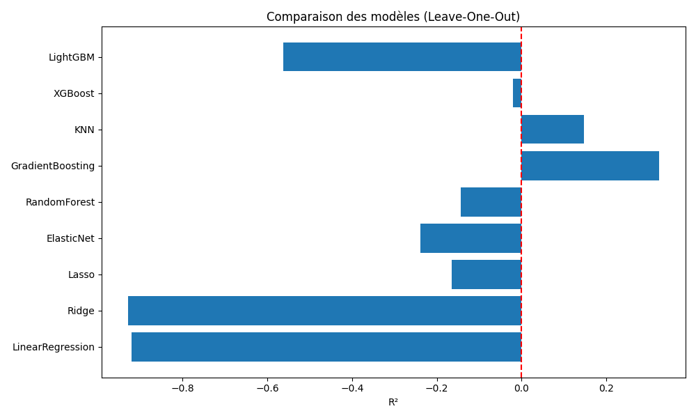
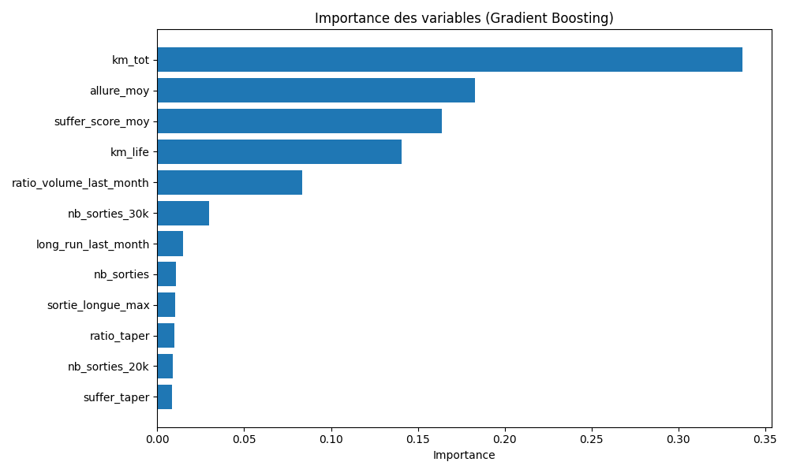

# 🏃 Marathon Performance Prediction (Strava + Machine Learning)

## 🎯 Objectif

Prédire mes performances marathon à partir de mes données Strava (6 derniers mois d’entraînement avant chaque course).

Ce projet est à la fois :

* Un **exercice de formation personnelle** en Data Science & Machine Learning appliqués au sport.
* Un début de **MVP** montrant comment les données d’entraînement peuvent être exploitées pour estimer (et à terme optimiser) la performance en course sur route.

---

## 📂 Structure du projet

```
.
├── strava_auth.py            # Authentification + refresh token Strava
├── strava_fetch.py           # Récupération des activités via API Strava
├── build_marathon_dataset.py # Feature engineering (6 mois avant chaque marathon)
├── multi_mod.py              # Comparaison multi-modèles avec Leave-One-Out
├── loo_GBR_marathon.py       # Analyse détaillée GradientBoosting (baseline)
├── data/                     # Données dérivées (CSV anonymisés)
├── images/                   # Graphiques pour le README
└── README.md                 # Ce document
```

---

## 📊 Données utilisées

* **Source :** API Strava (mes données personnelles).
* **Fenêtre :** 180 jours avant chaque marathon.
* **Exemples de features construites :**

  * `km_tot` : volume total sur 6 mois
  * `km_life` : kilométrage cumulé à vie
  * `nb_sorties_20k`, `nb_sorties_30k` : nombre de sorties longues
  * `sortie_longue_max` : distance max
  * `allure_moy`, `suffer_score_moy` : vitesse moyenne & intensité
  * `ratio_taper`, `suffer_taper` : gestion de l’affûtage
  * `perf_sec` : temps marathon en secondes (cible)

---

## 🧑‍💻 Méthodologie

1. **Feature engineering** avec `build_marathon_dataset.py`
2. **Validation Leave-One-Out (LOO)** → adaptée à mon petit dataset (5 marathons)
3. **Comparaison de 9 modèles** de régression :

   * LinearRegression, Ridge, Lasso, ElasticNet
   * RandomForest, GradientBoosting
   * KNN, XGBoost, LightGBM
4. **Évaluation** :

   * MAE (minutes)
   * R² (qualité explicative)

---

## ✅ Résultats principaux

| Modèle               | MAE (min) | R²   |
| -------------------- | --------- | ---- |
| **GradientBoosting** | **4.4**   | 0.32 |
| KNN                  | 5.3       | 0.15 |
| Autres modèles       | >6 min    | ≤0   |

* **GradientBoosting** retenu comme baseline → ~4 minutes d’erreur moyenne.
* Modèle robuste sur mes marathons “normaux” (2h46–2h55).
* **Sous-estimation forte** de mon premier marathon (3h06) → préparation atypique (volume faible, premier essai, taper limité).

---

## 🔍 Analyse détaillée (GradientBoosting)

**Erreur par marathon :**

| Marathon | Réel    | Prédit  | Erreur    |
| -------- | ------- | ------- | --------- |
| 1        | 2:46:20 | 2:50:25 | +4:05     |
| 2        | 2:48:25 | 2:51:40 | +3:15     |
| 3        | 2:52:33 | 2:52:39 | +0:06     |
| 4        | 2:55:57 | 2:53:14 | -2:42     |
| 5        | 3:06:36 | 2:54:52 | -11:43 🔥 |

👉 Le modèle **apprend bien ma zone habituelle** (~2h50), mais échoue sur un cas atypique.

---

## 📈 Visualisations clés

1. **Comparaison réel vs prédit (GradientBoosting)**
   

2. **Erreur absolue moyenne par modèle**
   
   
3. **R² par modèle**
   

4. **Importance des variables (GradientBoosting)**
   

---

## 🧠 Interprétation

* Le modèle retrouve les **principes d’entraînement reconnus** :

  * Volume (`km_tot`),
  * Intensité (`suffer_score_moy`),
  * Vitesse moyenne (`allure_moy`),
  * Expérience cumulative (`km_life`).
* Les erreurs viennent des cas atypiques (1er marathon) → **non prévisibles** uniquement via l’entraînement : pas de stratégie de pacing ou d'objectif chrono.
* Projet = Manque de précision dans les données utilisées, avec uniquement de l'agrégation.

---

## 🚀 Limites & perspectives

* **Dataset personnel (n=5)** → faible généralisation
* **Pas de cas de défaillance majeure** (mur, blessure, météo extrême) et, ici, **chaque marathon est meilleur que le précédent**
* Fonctionne comme un prédicteur “normal” mais pas “imprévisible”

**Améliorations possibles :**

* Enrichissement avec **streams Strava** (variabilité allure, zones de FC, régularité pacing)
* Intégration **météo & profil de parcours**
* Tests sur un dataset **multi-athlètes**
* Déploiement d’un **dashboard interactif (Streamlit/Dash)**

---

## 👤 Auteur

Projet personnel de reconversion vers la Data Science appliquée au sport.
Démonstration de compétences en **Machine Learning, analyse sportive, et storytelling data**.

---


